# Covid19-Global-Dashboard-Using-Azure-Cloud
In This Project I used Azure Cloud to create DB, Extract Data From Browse and Data Analysis After This I used Power BI to Visualization my Data By Dashboard
---
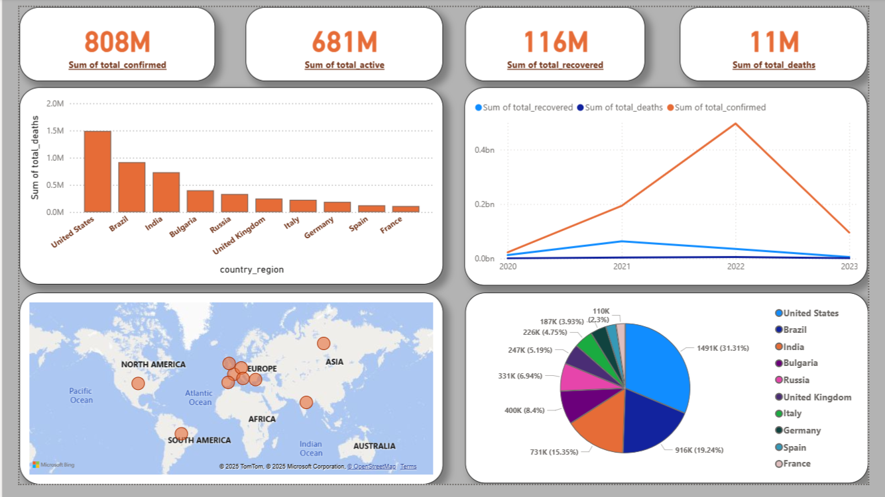
---
---

# Microsoft Azure

## Steps:

---

### • Create Synaps Analytics
By using Azure Synaps Analytics Create workspace named ahmeds11
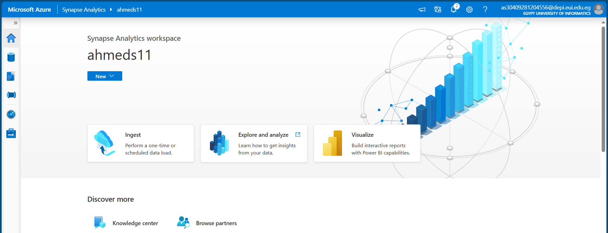

---

### • Create Database Covid19
using SQL Pool and Create Database in Cloud named covid19
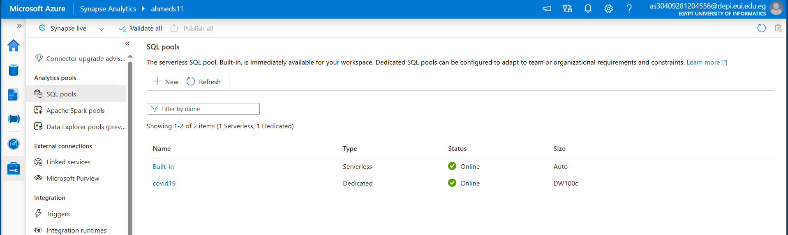

---

### • Upload DataSet Covid19 Golbal
Taking DataSet From Browse in Workspace
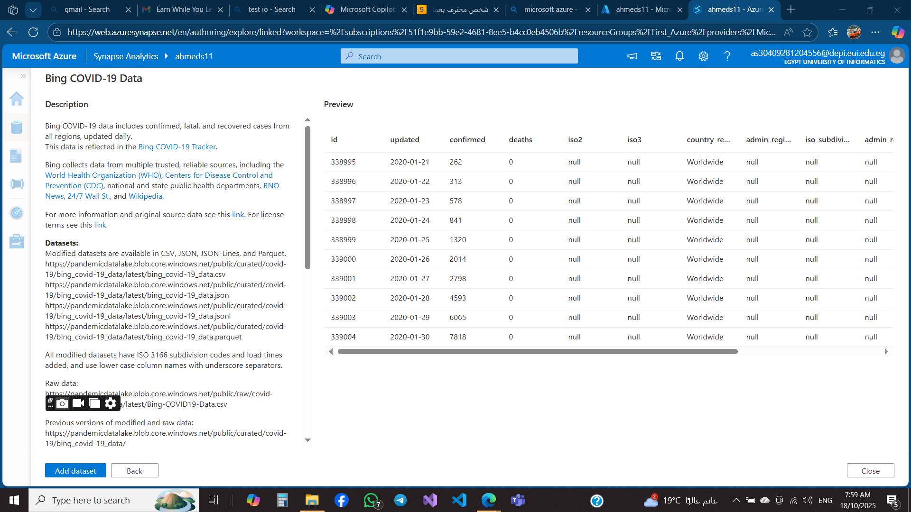

---

---

### • DataSet Added Successfuly
The Data has been added in file and workspace

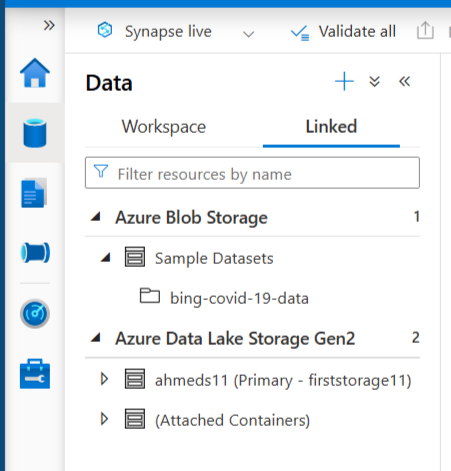

---

---

### • Create Table Covid-Info Taking Data From DataSet
This Table To limit Data from Large DataSet Covid19-Golabal
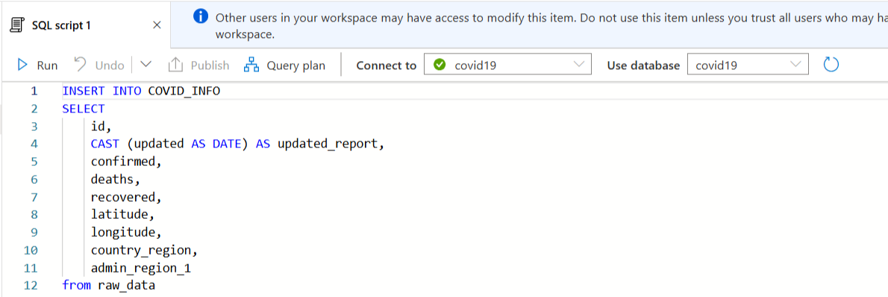
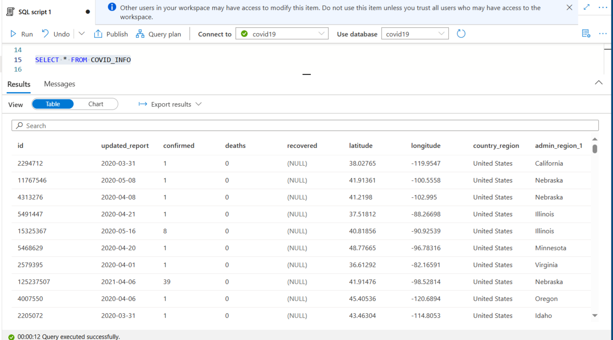

---

---

### • Create View Total To Calculate Analytics 
This Step is more importanat to Visualize Data in Power BI
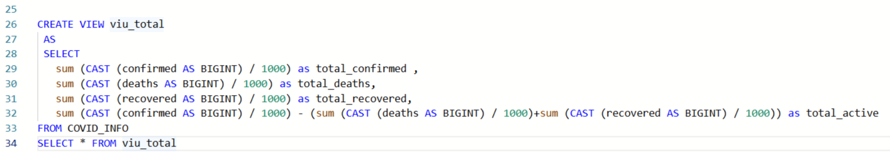
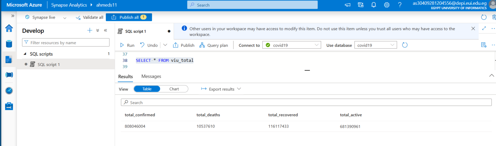

---

---

### • Create View Covid Trend
This View Groubed Analysis By Date To Take Info about each date
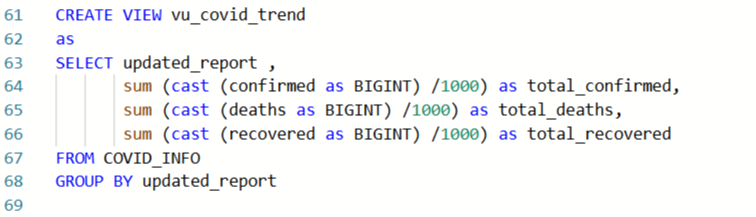
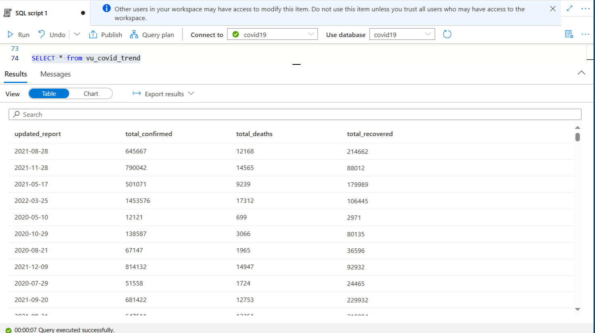

---

---

### • Finally Create View Covid Trend
This View Orderd Contries Desc By Total-Conforimed To Covid19
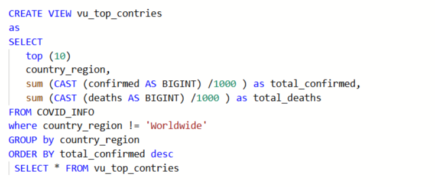

---
